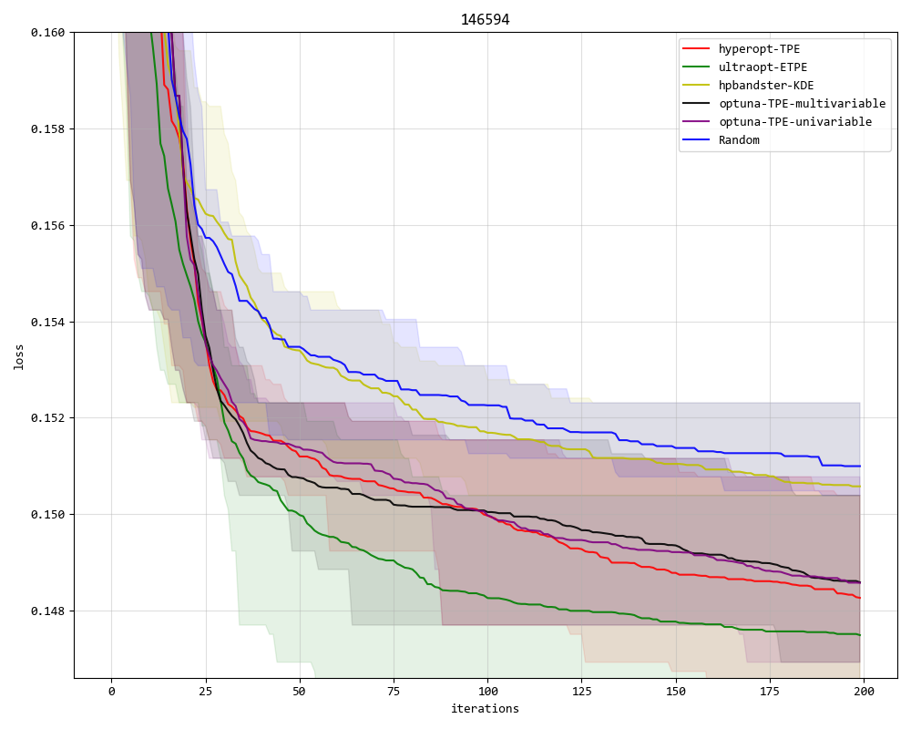
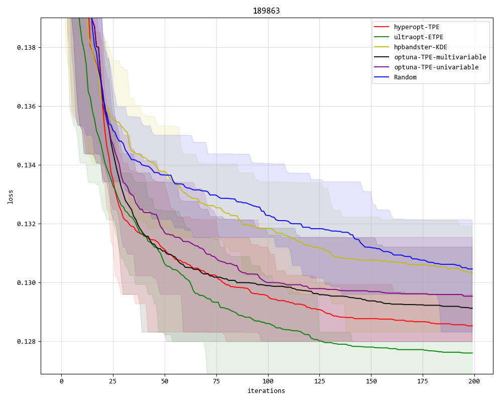
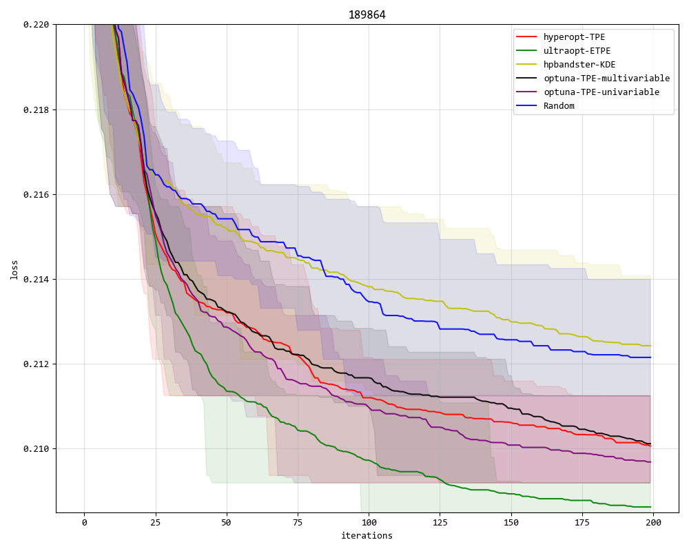

# Machine-Learning Pipeline Experiment

Experiments about several Bayesian Optimization Algorithms performance in `Machine-Learning Pipeline Space`

In this Experiments, our's ETPE(Embedding Tree Structure Estimators) implemented in [UltraOpt](https://github.com/auto-flow/ultraopt) is out perform other TPE algorithms, for example, initial TPE implemented in [HyperOpt](https://github.com/hyperopt/hyperopt) .

## Build Machine-Learning Pipeline Space

We provide several scripts to build `Machine-Learning Pipeline Space`. We have built three **Space** which is public available:

- [146594 dataset](processed_data/d146594_processed.csv)
- [189863 dataset](processed_data/d189863_processed.csv)
- [189864 dataset](processed_data/d189864_processed.csv)

## Start-Up Experiments between Bayesian Algorithms

After clone this repositary and install necessary requirements, you can Start-Up Experiments between Bayesian Algorithms in following operations:

1. clone this repositary and install necessary requirements

```bash
git clone https://github.com/auto-flow/ml-pipeline-experiment
cd ml-pipeline-experiment
pip install -r requirements.txt
```

2. Start-Up Experiments between Bayesian Algorithms

```bash
cat experiments/run_experiments_146594.sh|parallel -j 6
cat experiments/run_experiments_189863.sh|parallel -j 6
cat experiments/run_experiments_189864.sh|parallel -j 6
```

## Results and Conclusion





In this Experiments, our's ETPE(Embedding Tree Structure Estimators) implemented in [UltraOpt](https://github.com/auto-flow/ultraopt) is out perform other TPE algorithms.